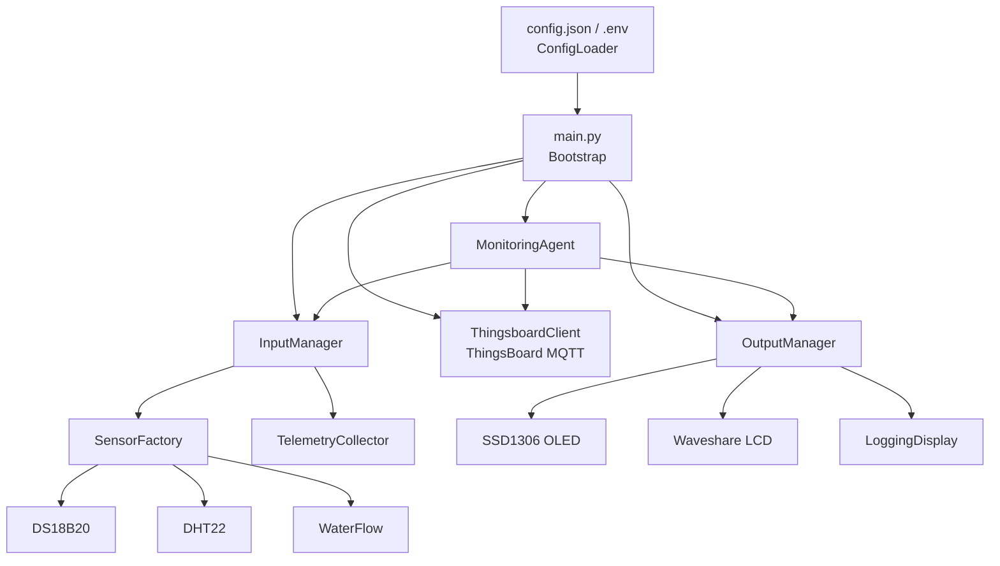

# Architecture Overview

## Module dependency flow

Dependencies flow inward toward simple data structures. Each layer knows only its own job, takes dependencies via constructor injection, and is unaware of the layers above or beside it.



## Data flow (telemetry pipeline)

```
Sensor.read()
  → key mapping
  → calibration (value * slope + offset)
  → EMA smoothing
  → range filtering
  → precision rounding
  → merged telemetry dict
      → ThingsboardClient (ThingsBoard MQTT)
      → OutputManager → Display drivers
```

## Key modules

| Module | Responsibility |
|--------|----------------|
| `main.py` | Bootstrap only: loads config, constructs all components, wires dependencies, starts agent |
| `agent.py` | `MonitoringAgent` — runs the main loop, delegates collection to `InputManager` and rendering to `OutputManager` |
| `config/config_loader.py` | Merges `config.json` + `.env`, validates required fields. Only module that reads files |
| `inputs/input_manager.py` | Wraps `SensorFactory` + `TelemetryCollector` behind a single `collect()` interface |
| `inputs/sensors/` | One driver per sensor type. `BaseSensor` ABC, `read()` returns raw dict. Factory builds `SensorBundle` dataclasses (defined in `models.py`) |
| `inputs/telemetry.py` | `TelemetryCollector` — per-sensor interval scheduling, key mapping, calibration, EMA smoothing, range filtering, precision rounding |
| `outputs/output_manager.py` | Fans out snapshots to all displays, isolates failures, manages cleanup |
| `outputs/display/` | Display drivers — `BaseDisplay` ABC, `render()` / `render_startup()` / `close()`. Receive pre-formatted content; must not assemble telemetry strings |
| `transport/thingsboard_client.py` | `ThingsboardClient` — ThingsBoard MQTT client abstraction |
| `attributes/attributes.py` | `AttributesCollector` — static device attributes (hostname, MAC, IP, device name, software version) sent to ThingsBoard |
| `logging/logging_setup.py` | Central logger with `RotatingFileHandler`. Never imported ad-hoc into domain logic |
| `exceptions/` | Domain exceptions: `config_exceptions.py`, `factory_exceptions.py`, `sensor_exceptions.py` |

## Design rules

- **Module isolation** — no cross-import spaghetti, no shared global state, no circular dependencies
- **Constructor injection** — each module receives its dependencies; only the factory knows concrete classes
- **Replaceability** — any layer's implementation can be swapped (e.g. replace MQTT with HTTP, swap a sensor library) without other modules noticing
- **Display drivers are output-only** — they receive pre-formatted strings and render to pixels/text; they do not import `DisplayStatus` or reference telemetry key names
- **Sensor drivers are minimal** — they read hardware and return dicts; no logging, no transport awareness, no scheduling